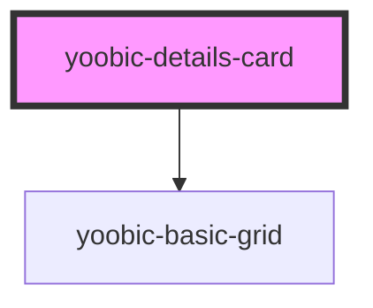

# my-component

<!-- Auto Generated Below -->

## Properties

| Property | Attribute | Description | Type     | Default     |
| -------- | --------- | ----------- | -------- | ----------- |
| `image`  | `image`   |             | `string` | `undefined` |
| `info`   | --        |             | `any[]`  | `undefined` |
| `name`   | `name`    |             | `string` | `undefined` |

## Dependencies

### Depends on

- yoobic-basic-grid

### Graph

----------------------------------------------

*Built with [StencilJS](https://stenciljs.com/)*
